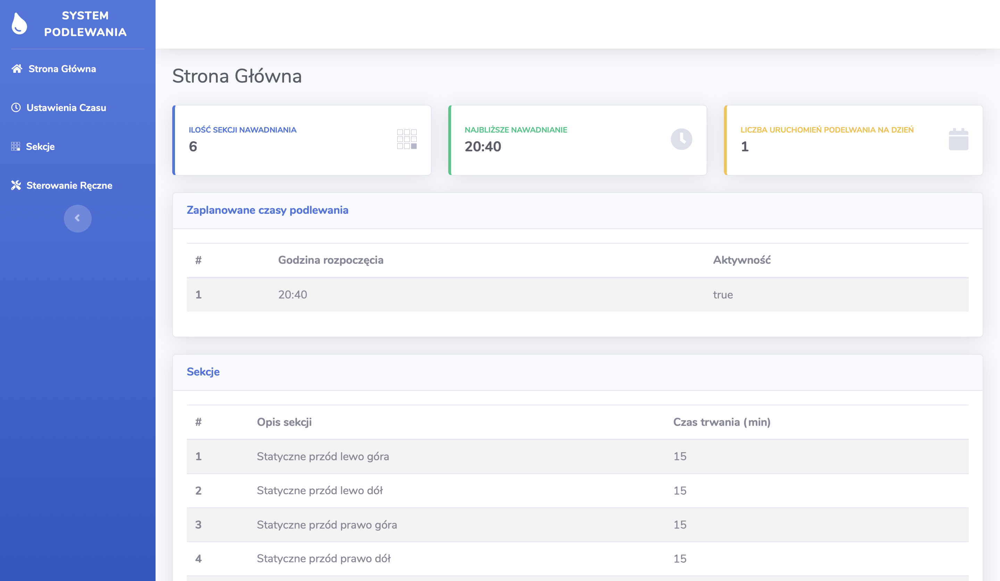
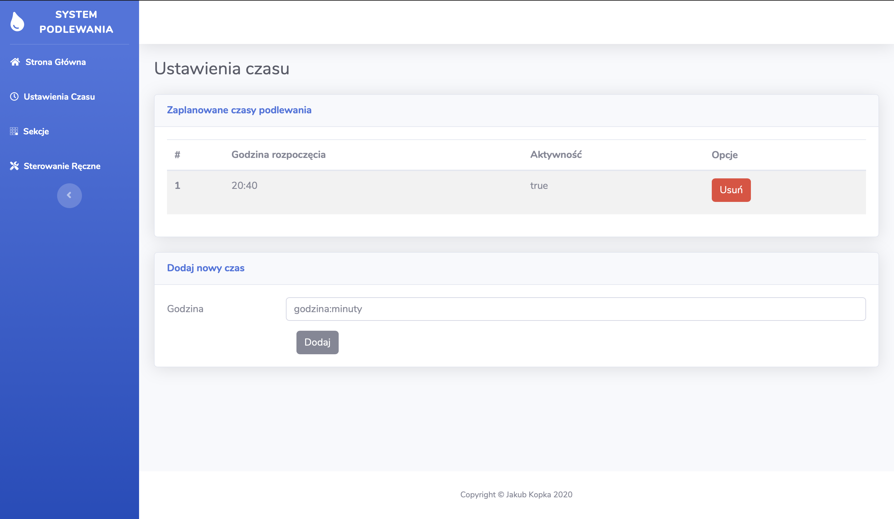
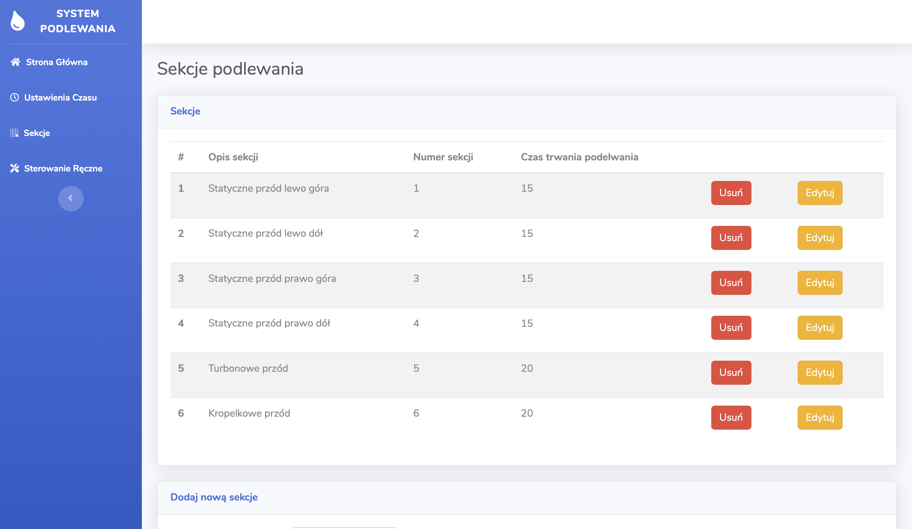
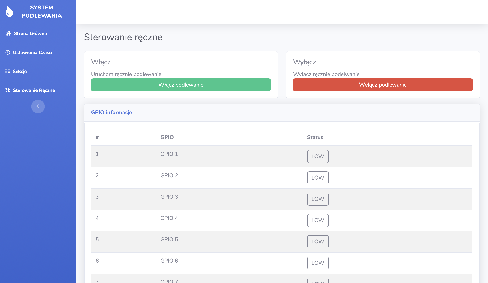

## System Nawadniania 

### Opis

System zarządzania podelwaniem ogrodu oparty na Raspberry Pi oraz Spring Boot.

Do stworzenia projektu wykorzystałem:

#### Soft
- Spring Boot
- Hibernate 
- Thymeleaf 
- Spring Security
- MySQL

#### Hardware
- Raspberry Pi 
- Przekaźniki 

#### ToDo
- Dokończyć sterowanie ręczne

## Screens
#### Strona Główna

#### Ustawienia Czasu

#### Sekcje

#### Dodawanie Sekcji 

#### Sterowanie Ręczne

Frontend został oparty na szablonie <a href="https://startbootstrap.com/themes/sb-admin-2/" target="_blank">SB-Admin 2</a>
